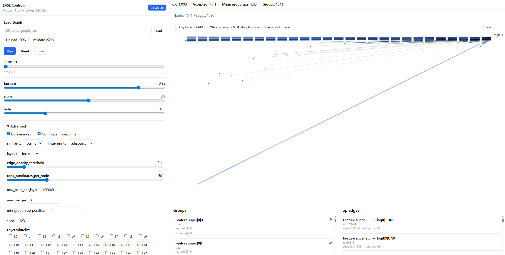
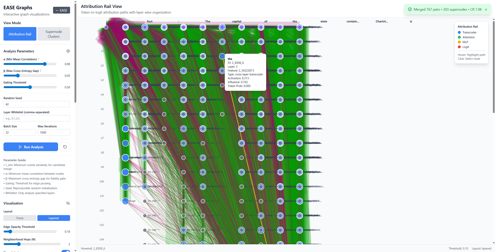
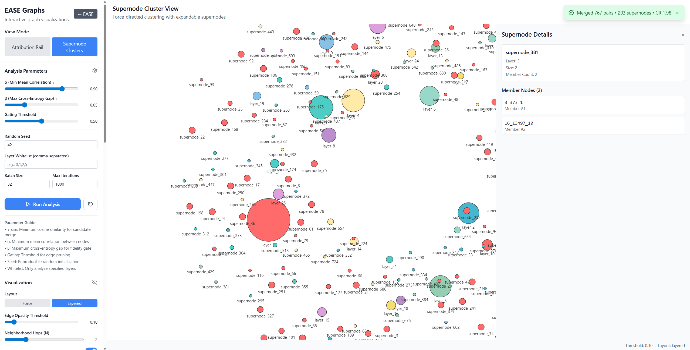

# EASE: Exploratory Automated Supernode Extraction

This repo contains a FastAPI backend and a React (Vite) frontend for automated supernode reconstruction with fidelity-gated similarity merges and live visualization.

## UI Overview

### Main Page


### Attribution Graph


### Supernode Clusters


## Prerequisites
- Python 3.11+
- Node.js 18+ and npm

## Quickstart

### 1) Backend (FastAPI)
From `ease/backend/`:

```bash
# create & activate venv (Windows PowerShell)
python -m venv .venv
.\.venv\Scripts\Activate

# upgrade build tooling
python -m pip install --upgrade pip setuptools wheel

# install backend package (installs FastAPI, uvicorn, numpy, scipy, scikit-learn, etc.)
pip install -e .

# run server on http://localhost:8000
uvicorn app.main:app --reload --port 8000
```

Notes:
- Default Charlotte dataset path is `ease/data/charlotte_neuronpedia.json`.
- Override with environment variable `EASE_DATA_PATH` if desired.
- CORS allows `http://localhost:5173` for the frontend by default (see `backend/app/config.py`).

Alternate run from repo root:
```bash
python -m uvicorn app.main:app --reload --port 8000 --app-dir backend
```

### 2) Frontend (Vite + React)
From `ease/frontend/`:

```bash
npm install
npm run dev
```
Open the app at http://localhost:5173.

The frontend auto-targets the backend at `http://localhost:8000` when running on `localhost` (see `frontend/src/services/supernodes.ts`). No .env is required for local dev.

## API Overview (Supernodes)
Base path: `http://localhost:8000/api/supernodes`

- `GET /config/defaults`
  - Returns default reconstruction parameters:
    - `tau_sim` (cosine similarity threshold)
    - `alpha` (min mean correlation)
    - `beta` (max cross-entropy gap)
    - `intra_layer_only` (restrict merges within layer)

- `GET /charlotte-data`
  - Returns the Charlotte Neuronpedia attribution graph JSON used in demos.

- `POST /reconstruct`
  - Body:
    ```json
    {
      "attribution_graph": { /* attribution graph JSON */ },
      "config": {
        "tau_sim": 0.98,
        "alpha": 0.90,
        "beta": 0.05,
        "intra_layer_only": true
      }
    }
    ```
  - Response includes `supernodes`, `rewired_graph`, `merge_log`, and `stats`.

- `POST /reconstruct-charlotte`
  - Convenience endpoint that runs reconstruction using the built-in Charlotte dataset. Optional body is the same `config` object.

## Frontend Integration Highlights
- `EnhancedGraphRoute` loads Charlotte data and default config on mount.
- Switching to “Supernode” view triggers reconstruction via backend.
- UI controls let you adjust `tau_sim`, `alpha`, `beta`, `intra_layer_only` and regenerate in real-time.
- Falls back to heuristic grouping if backend data is unavailable.

Key files:
- Backend routes: `backend/app/api/supernodes.py`
- Reconstruction pipeline: `backend/app/services/supernode_reconstruction.py`
- Frontend services: `frontend/src/services/supernodes.ts`
- React integration: `frontend/src/components/EnhancedGraphRoute.tsx`

## Troubleshooting
- SciPy / scikit-learn wheels: ensure you’re on Python 3.11+ and upgrade build tools:
  ```bash
  python -m pip install --upgrade pip setuptools wheel
  ```
- CORS: the backend allows `http://localhost:5173`. If you change ports, update `backend/app/config.py`.
- Data path: set `EASE_DATA_PATH` to point to a Neuronpedia-style JSON graph if not using the default Charlotte file.
- Ports: frontend dev server runs on 5173, backend on 8000. Make sure both are running locally.

## Development

This is an active research project. The codebase is under active development and the API may change.

## Contributing

Contributions are welcome! Please open an issue to discuss potential changes before submitting a pull request.
